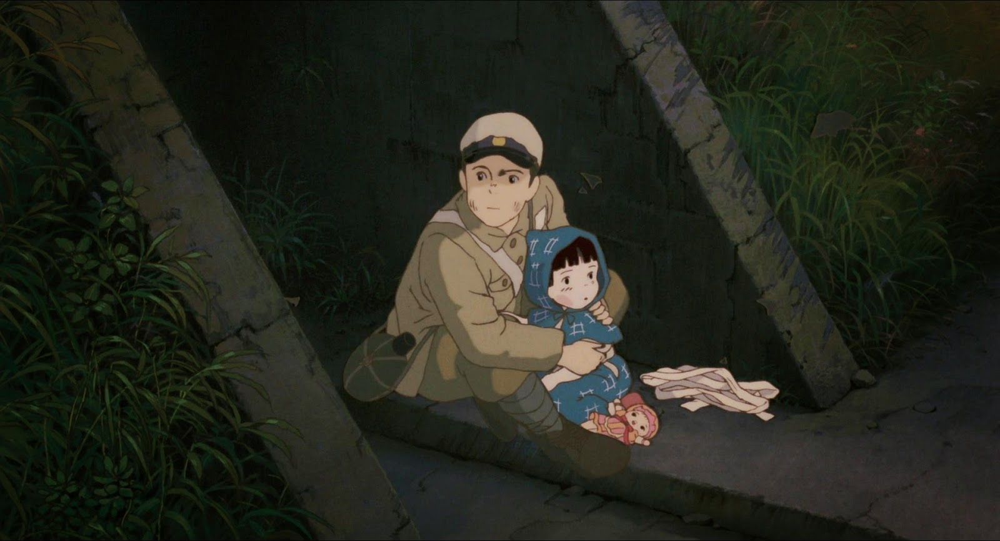

# La Tumba de las Luciérnagas

_Reseña elaborada por Kimberline Reyes Macis_

## Ficha Técnica 
- Dirección:Isao Takahata
- Producción:Toru Hara
- Guion:Isao Takahata,Akiuiki Nosaka
- Basada en el libro de *La tumba de las luciérnagas* de Akiuiki Nosaka
- Productora: Studion Ghibli
- Año de estreno: 1988
- Música: Michio Mamiya 
- Fotografía: Nobuo Koyama 
- Montaje:Takeshi Seyama
- País de Origen: Japón 
- Género Anime: Drama, Historia, Belico, Anime.
- Duracion: 89 minutos.

**_Sinopsis_**:

La película  *La Tumaba de las luciérnagas* de _Isao Takahata_ nos narra vida de 2 hermanos en medio de la Segunda Guerra Mundial y como estos tratan de sobrevivir en el mundo caoitico de la guerra.

**_Personajes y escenario de trama:_**

La película transcurre en Japón después de la Segunda Guerra Mundial nos ponemos en los zapatos de un adolescente llamado Seita de 14 años y su hermana Setsuko de 4 años.

**_Resumen:_**

Los dos hermanos, Seita y Setsuko se encontraban en la ciudad de Kobe con su madre ya que su padre trabaja como capitán en la armada japonesa, mientras que Seita estaba resguardando la comida y demás recursos, su madre se adelanta al refugio antiaéreo ante un posible ataque por parte de los Estados Unidos, mientras que Seita y su hermana salen después de guardar todo,  un ataque por parte de uno de los porta aviones de los Estados Unidos con miles de bombas tomo por sorpresa a todos los habitantes incluyendo a los hermanos al salir de la casa lo único que puede hacer Seita es cargar a su hermana en la espalda y correr hasta que llegan a un lugar seguro,  después Seita y su hermana se dirigen a una escuela donde daban primeros auxilio, una amiga de la familia le dice a Seita que la madre de los dos hermanos estaba gravemente herida, Seita inmediatamente va a buscar a su madre solo para ver como poco después esta muere, lo único que puede hacer Seika es mentirle a su hermana,  Setsuko llora desconsolada pero Seita a pesar de su angustia hace lo posible para que su hermana no piense en eso. 

Estando los dos hermanos solos Seita opta por ir a donde una tia que les da asilo, dándole a esta los suministros que habían resguardado antes del devastador ataque aunque este guarda una lata de dulces que le encantan a su hermana, la convivencia con la tia iba bien al principio hasta que la situación se vuelve más tensa hasta llegar a un punto de quiebre,  los hermanos salen otra vez a dar un paseo y son nuevamente sorprendidos por un bombardeo corren y descubre un refugio antiaéreo, el que deciden seria su hogar, _sin imaginar que ese seria el comienzo de la decadencia de estos hermanos_ . 

Al instalarse en su nuevo hogar compran todo lo que necesitan comida y demás, en la noche atrapan luciérnagas y estas les brindan un show de luces a los hermanos, al día siguiente las luciérnagas ya no están vivas y Setsuko entre lagrimas en sus ojos las comienza a enterrar diciendo que las enterraría tal y como enterraron a su madre,  resulta que la tia le había dicho a la niña que su madre estaba muerta, Seita solo rompe en llanto. 

En un momento se les acaba la comida en un acto desesperado Seita intenta robar una caña de azúcar ya que su hermana estaba enferma, el granjero al percatarse de la presencia de Seita lo agarra y le da una brutal paliza, lo lleva ante la policía y el oficial se apiada del pobre chico, al salir Seita este no puede hacer nada más que llorar... se les están acabando las opciones. 

En los siguientes bombardeos Seita aprovecha para robar comida de las casas, aunque lleva comida al refugio donde estaban, no era suficiente, su hermana cada vez enfermaba más y más, hasta que un día la encontró en el suelo desmayada, al llevarla al doctor este les dice friamente que esta muy desnutrida, el problema esque no tenían nada que comer.

Seita nuevamente embuelto en la desesperacion retira el poco dinero que tenia su madre y se apresura a comprar comida al regresar solo ve como su hermana comienza a delirar, Seita con sus ojos llenos de lagrimas, le da un poco de sandia y la pequeña Setsuko se lo agrádese, *siendo estas sus ultimas palabras...* y en un suspiro la pequeña Setsuko se va,  Seita solo puedo quemar a su hermana con un poco de paja guardando sus cenizas en la caja de dulces. 

Al final Seita en un estado deplorable murió convirtiéndose en un numero en una estación de tren, siendo un niño más en la lista de miles de niños muertos, la película nos deja con un sabor amargo pero como ultima escena de esperanza nos muestran las almas de los hermanos juntos otra vez riendo y disfrutando mientras las luciérnagas bailan alrededor de estos y por fin son felices,  lejos de todo el mal para siempre... 

**_Analisis historico, Geografico y conclusion de la reseña:_**

Para dar una pincelada en el contexto histórico, uno de los artículos de National Geografic, nos relata el nacimiento de la primera bomba atómica, pero mi interés en este articulo es el _Geografico_ como futura geógrafa hay que saber que la geografía juega un papel importante en temas de la guerra junto con otras ciencias de estudio de territorio,  mi interés sobre este articulo esque toca un punto muy importante, **porque justamente la primera bomba lanzada en el mundo por parte de estados unidos tubo que ser puesta a prueba en Japón**. 

Realmente como nos dice el Articulo, Japón ya veía su derrota, su ciudades estaban pasando una gran hambruna y muchas de sus ciudades habían sido devastadas, asique _porque_, no se tenía ningún interés económico, se nos dice en el Articulo que EE. UU al Japón negarse a firma su rendición (más que todo por orgullo) EE. UU inicio inmediatamente operativos, analizando el territorio japones, analizando cual de sus ciudades más influyentes seguía en pie, escogiendo a Hiroshima, como primer objetivo, al estudiar el territorio los Estadounidenses sabían cual ciudad era la que podía ser la determinante de la rendición de los Japoneses, llevando a cabo a mi opinión un estudio regional en manos de geógrafos,  siendo esta una de las maneras más factibles de poder dar justo en el blanco. 

Y en mi pensamiento Japón fue un objetivo perfecto para EE. UU para llevar a una "Prueba" a gran escala, siendo esta un éxito, no solo por el tamaño de la ciudad atacada si no por Japón mismo, los EE. UU podían estudiar las repercusiones de su creación en su "prueba a gran escala" (Japón) y ver como el paisaje de la zona es moldeado por diferentes factores químicos y ambientales, además del flujo de población, tenemos que tomar en cuenta que la población japonesa cayo drásticamente, como los vimos en el resumen anterior de _la Tumba de las luciérnagas_ el hambre y el desplazamiento por parte de los Japoneses moldeo el paisaje,  convirtiéndose las ciudades menos afectadas en los epicentros por aquella época. 

También el como ciencias como la geografía, topografía, cartografía, Arquitectura y etc., fueron las encargadas de volver a reconstruir las ciudades, tendiendo que hacer un estudio intenso sobre factores como el suelo para ver que tan factible era construir una ciudad desde cero.
A día de hoy las devastadoras repercusiones de la Bomba Atómica en Japón dejaron cicatrices en este país, modificando su paisaje, confirmándonos que los únicos que pueden cambiar una región son los mismos seres humanos.

- [Bomba atómica de Hiroshima: 4 datos que explican cómo se produjo el primer bombardeo nuclear de la historia](https://www.nationalgeographicla.com/historia/2022/08/bomba-atomica-de-hiroshima-4-datos-que-explican-como-se-produjo-el-primer-bombardeo-nuclear-de-la-historia)

Como punto cierre personal, para nadie es un misterio que la Guerra es una de las aberraciones más grandes cometidas por la humanidad, no solo por las masacres en el momento que dejan, millones de muertes, si no por los problemas a largo plazo, y esta película nos muestra esa cruda eh inhumana realidad, la historia esta basada en 2 hermanos japoneses que vivieron esos momentos de angustia en carne propia,  para muchos esta película es evidencia de como el único ser que nunca debió de haber existido es el humano y para otros muestra un historia de crueldad por parte de aquellas personas que con los medios suficientes no brindaron su ayuda a aquellos que lo necesitaban. 
Para mi esta es una película que conmemora a todos aquellos niños que en su plena infancia eh inocencia tuvieron que vivir momentos tan desgarradores como estos, niños que no tenían la culpa de nada y aun asi pagaron por una guerra que no pidieron.
Al analizar el nombre de esta película y terminar de ver la película ese nombre tiene todo el sentido, las luciérnagas son como nosotros, son tan frágiles, bellas y llenas de vida, pero como simples mortales que somos, esa luz, esa vida que tanto la caracteriza tarde o temprano se tiene que apagar, como en la película los hermanos tuvieron breves momentos de felicidad plena,  donde brillaron en su inocencia hasta terminar **desvaneciendo**. 

La pelicula aunque no lo paresca realmente tiene una conexión con la *Geografia*, solo resalto el factor social y como este drasticamente cambio el paisaje de una región tal y como los vimos en la pelicula, las bombas, el desplazamiento de población y las altas estadísticas de muertes, cambiaron todo un pais, siendo Japón un ejemplo de la mobilidad de la poblacion y sus repercuciones en determinadas zonas. 

 

**_Banda Sonora y Estudio:_** 

La pelicula nos trae Ost musicales que valen la pena escuchar, te invito a que escuches uno de sus temas:

- [Banda sonora - La tumba de las luciérnaga](https://www.dailymotion.com/video/x2s9b1i)

El estudio de animación _Studio Ghibli_ a sido el responsable de grandes obras, a continuaón te dejare más información relacionada con el estudio de animación junto con la del Director *Isao Takahata* eh  iformacion mas detallada de la pelicula centrandose mas en los hechos historicos de esta:

- [Estudio Studio Ghibli](https://es.wikipedia.org/wiki/Studio_Ghibli)

- [Isao Takahata](https://es.wikipedia.org/wiki/Isao_Takahata)

- [La tumba de las luciérnagas](https://es.wikipedia.org/wiki/La_tumba_de_las_luci%C3%A9rnagas)

## Bibliografía:

1. Banda sonora - La tumba de las luciérnagas - video Dailymotion. (2015). Dailymotion. https://www.dailymotion.com/video/x2s9b1i

2. Colaboradores de Wikipedia. (2023). _La Tumba de las luciérnagas. Wikipedia_, la enciclopedia libre.https://es.wikipedia.org/wiki/La_tumba_de_las_luci%C3%A9rnagas 

3. Colaboradores de Wikipedia. (2023). _Studio Ghibli_. Wikipedia, la enciclopedia libre. https://es.wikipedia.org/wiki/Studio_Ghibli

4. Colaboradores de Wikipedia. (2023). _Isao Takahata_. Wikipedia, la enciclopedia libre. https://es.wikipedia.org/wiki/Isao_Takahata

5. Israel Villejo, I. (2014). 'La tumba de las luciérnagas', la novela de Akiyuki Nosaka [Imagen]. https://generacionghibli.blogspot.com/2014/05/la-tumba-de-las-luciernagas-la-novela.html 

6. Takahata, I. (Director). (1988). _La tumba de las luciérnagas_ [Película]. Estudio Ghibli, Shinchōsha. 

7.  National Geographic España. (2022, 5 agosto). National Geographic. https://www.nationalgeographicla.com/historia/2022/08/bomba-atomica-de-hiroshima-4-datos-que-explican-como-se-produjo-el-primer-bombardeo-nuclear-de-la-historia

Seita nuevamente embuelto en la desesperacion retira el poco dinero que tenia su madre y se apresura a comprar comida al regresar solo ve como su hermana comienza a delirar, Seita con sus ojos llenos de lagrimas, le da un poco de sandia y la pequeña Setsuko se lo agrádese, *siendo estas sus ultimas palabras...* y en un suspiro la pequeña Setsuko se va, Seita solo puedo quemar a su hermana con un poco de paja guardando sus cenizas en la caja de dulces.

Al final Seita en un estado deplorable murió convirtiéndose en un numero en una estación de tren, siendo un niño más en la lista de miles de niños muertos, la película nos deja con un sabor amargo pero como ultima escena de esperanza nos muestran las almas de los hermanos juntos otra vez riendo y disfrutando mientras las luciérnagas bailan alrededor de estos y por fin son felices, lejos de todo el mal para siempre...

**_Conclusión:_**

Para nadie es un misterio que la Guerra es una de las aberraciones más grandes cometidas por la humanidad, no solo por las masacres en el momento que dejan, millones de muertes, si no por los problemas a largo plazo, y esta película nos muestra esa cruda eh inhumana realidad, la historia esta basada en 2 hermanos japoneses que vivieron esos momentos de angustia en carne propia, para muchos esta película es evidencia de como el único ser que nunca debió de haber existido es el humano y para otros muestra un historia de crueldad por parte de aquellas personas que con los medios suficientes no brindaron su ayuda a aquellos que lo necesitaban.
Para mi esta es una película que conmemora a todos aquellos niños que en su plena infancia eh inocencia tuvieron que vivir momentos tan desgarradores como estos, niños que no tenían la culpa de nada y aun asi pagaron por una guerra que no pidieron.
Al analizar el nombre de esta película y terminar de ver la película ese nombre tiene todo el sentido, las luciérnagas son como nosotros, son tan frágiles, bellas y llenas de vida, pero como simples mortales que somos, esa luz, esa vida que tanto la caracteriza tarde o temprano se tiene que apagar, como en la película los hermanos tuvieron breves momentos de felicidad plena, donde brillaron en su inocencia hasta terminar **desvaneciendo**.

**_Banda Sonora Y Estudio:_**

La pelicula nos da un tipo de musica unica y especial que a pesar de lo cruel que pueda ser, esta en su musica esta la inocencia, inocencia que como estas notas musicales llegan al alma y se quedan ahi para luego convertirse en un recuerdo más que no desea ser olvidad y no podemos olvidad.

Te invito a que escuches uno de sus temas:

- [Banda sonora - La tumba de las luciérnaga](https://www.dailymotion.com/video/x2s9b1i)

El estudio de animación _Studio Ghibli_ a sido el responsable de grandes obras que aunque algunas sean del genero fantasia son verdaderas joyas de arte, dejando una profunda sed de más a las almas que se alimentan de obras sublimes con mensajes criticos a nuestra sociedad y como el alma es la unica cosa libre que se puede juzgar a nuestra sociedad sin ser privada de su voz.

A continuacion te dejare mas informacion de este estudio y una de sus tantas obras, ademas de un resumen de la pelicula _La tumba de la Luciernagás_ donde detalla los sucesos historicos de esta pelicula llevandolos mas a fondo: 

- [Estudio Studio Ghibli](https://es.wikipedia.org/wiki/Studio_Ghibli)

## Bibliografía:

1. Banda sonora - La tumba de las luciérnagas - video Dailymotion. (2015). Dailymotion. https://www.dailymotion.com/video/x2s9b1i

2. Colaboradores de Wikipedia. (2023). _La tumba de las luciérnagas. Wikipedia_, la enciclopedia libre.https://es.wikipedia.org/wiki/La_tumba_de_las_luci%C3%A9rnagas

3. Colaboradores de Wikipedia. (2023). _Studio Ghibli_. Wikipedia, la enciclopedia libre. https://es.wikipedia.org/wiki/Studio_Ghibli

4. Israel Villejo, I. (2014). _'La tumba de las luciérnagas', la novela de Akiyuki Nosaka_ [Imagen]. https://generacionghibli.blogspot.com/2014/05/la-tumba-de-las-luciernagas-la-novela.html 

5. Takahata, I. (Director). (1988). _La tumba de las luciérnagas_ [Película]. Studio Ghibli, Shinchōsha.
